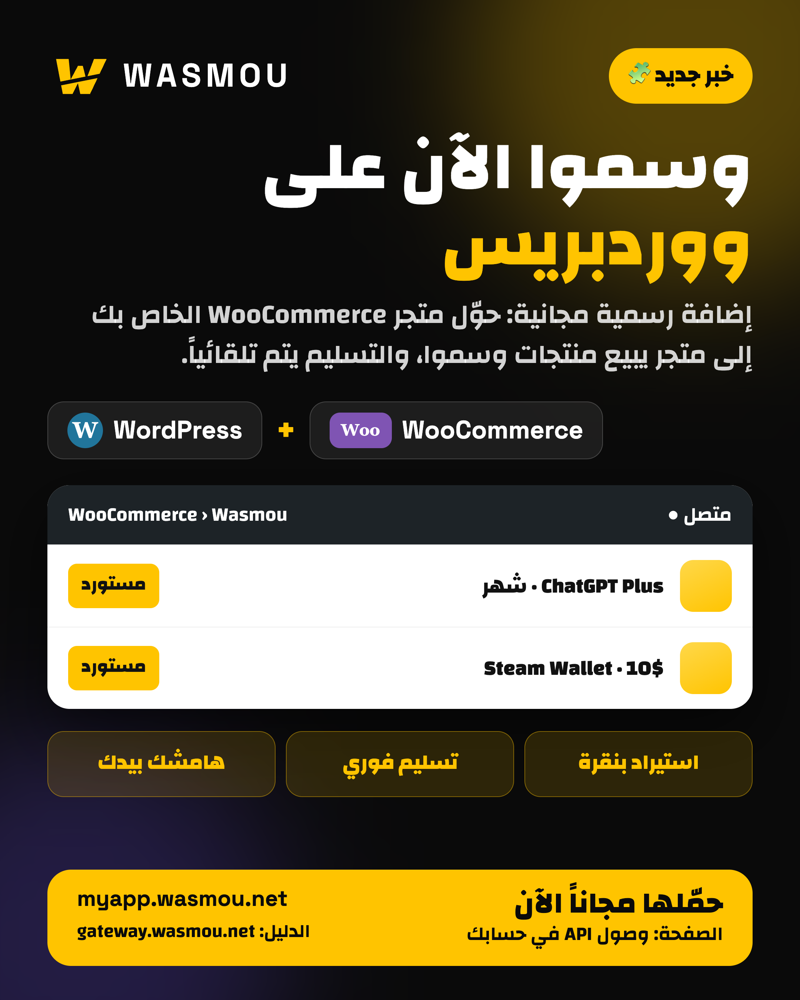
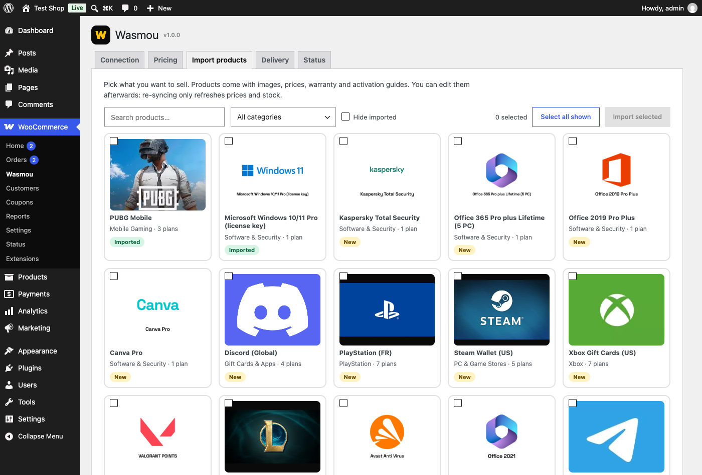
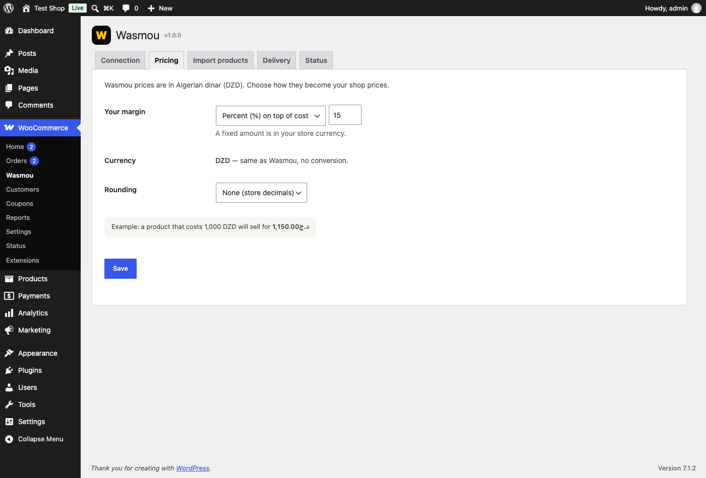
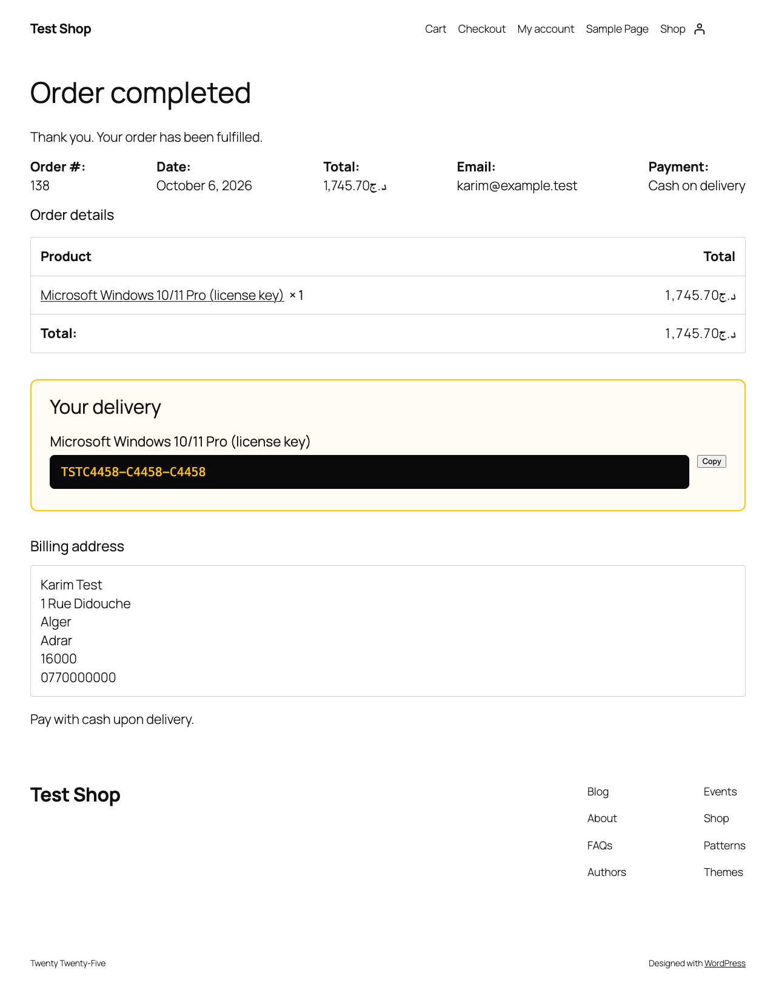

<p align="center">
  
</p>

<h1 align="center">Wasmou for WooCommerce</h1>

<p align="center">
  Sell gift cards, game top-ups, software licenses and AI subscriptions in your own WordPress store.<br>
  Import in one click. Prices and stock stay in sync. Codes are delivered automatically.
</p>

<p align="center">
  <a href="https://github.com/yxxhixx/wasmou-for-woocommerce/releases/latest/download/wasmou-for-woocommerce.zip"><b>⬇ Download the plugin (zip)</b></a> ·
  <a href="https://gateway.wasmou.net/guides/woocommerce-plugin">Documentation</a> ·
  <a href="https://myapp.wasmou.net">Get a Wasmou account</a>
</p>

<p align="center">
  
  
  
  
  
  
</p>

---

## What it does

[Wasmou](https://myapp.wasmou.net) is a wholesale platform for digital products. This plugin connects your WooCommerce store to your Wasmou account so you can resell its catalog **without handling stock or delivery yourself**:

1. A customer pays **you** in your store.
2. The plugin buys the product from your **Wasmou wallet** using the Wasmou API.
3. The code, license or activation details appear on the order page, in *My account* and in the order e-mail, with a **Copy** button and an activation guide.
4. The order is completed. You keep the margin.

You set your own prices, so you keep the difference between what you pay Wasmou and what your customer pays you.

## Screenshots

| Import products | Pricing | What your customer sees |
| :---: | :---: | :---: |
|  |  |  |

## Features

- **One-click import** with images, categories, plans (as variations), warranty and activation guides.
- **Your margin**: a percentage or a fixed amount on top of cost, rounding rules, and currency conversion from Algerian dinar (DZD). Prices never fall below your cost.
- **Automatic sync** of prices and stock (every 15 minutes by default). Re-syncing never overwrites your edits to titles, descriptions or categories.
- **Automatic delivery** of codes, with an activation guide and warranty shown to the customer in Arabic, French or English.
- **Buyer fields** (e-mail, player ID, account details) with validation, for top-ups and subscriptions.
- **Price protection**: the cart is re-checked against the live Wasmou price before payment.
- **Wallet protection**: checkout is blocked if your Wasmou balance can not cover the order, and you get a low-balance alert.
- **Safe purchases**: every purchase carries an idempotency key. Retries, crashes, network errors and double clicks can not buy twice.
- **Failure handling**: if an item can not be delivered, the order goes **On hold** and you are e-mailed, or the item is refunded automatically through your payment gateway.
- **Subscriptions** that are added to the customer's own account are followed until confirmed, and the customer is told what to expect.
- Compatible with **HPOS** (High-Performance Order Storage) and the **block-based Cart and Checkout**.
- Translated into **English, Français and العربية** (RTL friendly).

## Requirements

| | |
| --- | --- |
| WordPress | 6.0 or newer |
| WooCommerce | 7.0 or newer |
| PHP | 7.4 or newer |
| Wasmou | An account, an [API key](https://myapp.wasmou.net/app/api-access) and funds in your wallet |

## Installation

### From the zip (recommended)

1. Download **[wasmou-for-woocommerce.zip](https://github.com/yxxhixx/wasmou-for-woocommerce/releases/latest/download/wasmou-for-woocommerce.zip)** from the latest release.
2. In WordPress go to **Plugins → Add New → Upload Plugin**, choose the zip and click **Install Now**, then **Activate**.
3. Open **WooCommerce → Wasmou**.

### Manual

Upload the `wasmou-for-woocommerce` folder to `wp-content/plugins/` and activate it from the Plugins screen.

> Do not use GitHub's "Download ZIP" button on the repository page: it names the folder differently. Use the release zip above.

## Quick start

1. **Connection**: paste your Wasmou API key and press **Test connection**. You should see your wallet balance.
2. **Pricing**: choose your margin, your store currency and exchange rate (DZD per 1 unit of your currency), and a rounding rule.
3. **Import products**: search, tick what you want to sell and press **Import selected**.
4. **Delivery**: choose what happens after delivery and when Wasmou can not deliver.
5. Make a small test order before you announce your shop. Keep your Wasmou wallet funded: <https://myapp.wasmou.net/deposit>.

Your API key is stored in your own database and is only ever sent to the Wasmou API address configured in the plugin.

## Settings reference

| Tab | Setting | Notes |
| --- | --- | --- |
| Connection | API key | Wasmou account → menu → API access. Leave the masked value to keep the saved key. |
| Connection | Language of guides | Language of activation guides and descriptions. Defaults to the site language. |
| Pricing | Your margin | Percent on top of cost, or a fixed amount in your store currency. |
| Pricing | Exchange rate | DZD per 1 unit of your currency. Not needed if your store is in DZD. |
| Pricing | Rounding | None, whole number, end in .99, multiple of 5 or 10. |
| Delivery | After delivery | Mark the order Completed automatically. |
| Delivery | If Wasmou cannot deliver | Put on hold and e-mail you, or refund the failed items. |
| Delivery | Sync every | Minutes between price and stock refreshes. |
| Delivery | Low balance alert | Threshold in DZD and the e-mail that receives alerts. |

## How orders are processed

```
Customer pays  ──►  order "processing"  ──►  plugin buys each Wasmou item (idempotency key)
                                              │
              ┌───────────────────────────────┼──────────────────────────────┐
              ▼                               ▼                              ▼
        code delivered                 activation takes time          Wasmou refuses / fails
   shown on order + e-mailed       (subscriptions): plugin polls     order On hold + e-mail to you,
   order marked Completed          until confirmed, customer told    or automatic refund
```

If Wasmou can not be reached, the plugin retries safely with the same idempotency key, so a purchase that actually went through is never repeated.

## Troubleshooting

| Problem | What to do |
| --- | --- |
| "API key rejected" | Check the key. If you restricted it to IP addresses in Wasmou, allow your hosting server IP or clear the list. |
| An order stays **On hold** | Open the order. The **Wasmou** box shows the reason and a **Retry failed items** button. The most common cause is an empty wallet. |
| Products show out of stock | They are out of stock at Wasmou. Use **Sync prices and stock now** in the **Status** tab. |
| Delivery feels slow | WP-Cron needs traffic to run. Add a real cron job that calls `wp-cron.php` every minute. The **Status** tab tells you if WP-Cron is disabled. |
| Prices look wrong | Check the exchange rate: it is DZD per 1 unit of your store currency. |

Plugin logs are available in **WooCommerce → Status → Logs** (source `wasmou`).

## Uninstall

Deleting the plugin removes its settings, caches and scheduled tasks. Imported products and the codes already delivered on orders are kept: they belong to you.

## Testing

Before release the plugin was exercised against a local Wasmou environment (not live purchases) with automated suites and browser tests: concurrent orders, crashes and lost connections (no double purchase), refusals, price and wallet protection, subscription (asynchronous) delivery, My Account access control, HTTP security checks, block and classic checkout, legacy and HPOS order storage, and uninstall cleanup.

## Developers

The plugin uses the public Wasmou API only (`GET /catalog`, `GET /balance`, `POST /products/purchase/{variantId}`, `POST /products/orders/retrieve`) with the `X-Api-Key` header. Documentation: <https://gateway.wasmou.net>.

```
wasmou-for-woocommerce.php   plugin header, bootstrap, HPOS and blocks compatibility
includes/                    api, catalog, importer, pricing, storefront, fulfillment, admin, settings
assets/                      admin and storefront CSS/JS
languages/                   .pot, .po and .mo (ar, fr_FR)
uninstall.php                cleanup
```

Translations: update `languages/wasmou-for-woocommerce.pot` (for example with `wp i18n make-pot . languages/wasmou-for-woocommerce.pot`), then edit the `.po` files and compile them with `msgfmt`.

## Support

- Documentation: <https://gateway.wasmou.net/guides/woocommerce-plugin>
- Telegram: [@wasmou_app](https://t.me/wasmou_app)
- Bugs and ideas: open an [issue](https://github.com/yxxhixx/wasmou-for-woocommerce/issues)

## License

GPL-2.0-or-later. See [LICENSE](LICENSE).
